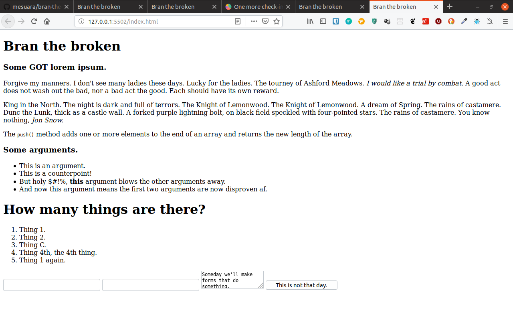

# bran-the-broken

### Introduction

Oops! _Someone_ appears to have broken our html. Whatever are we to do?

Wait, _you_ know html? Oh thank goodness! Can I get a little help over here?

### Your Task

We've taken a properly functioning bit of html and broken it. Your task is to fix it.

Here's what it's supposed to look like:

---

---

But some sneaky mistakes might be in the code only.

Good luck!